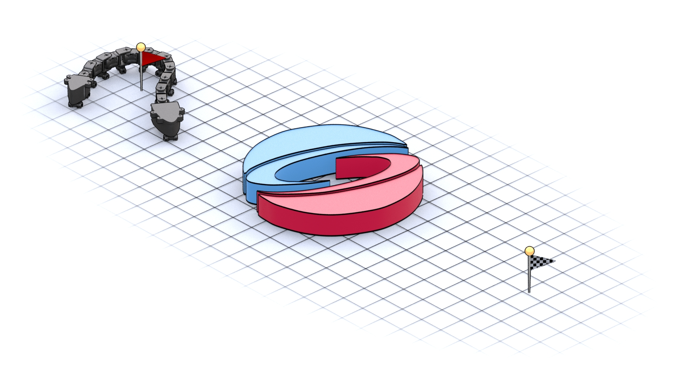

<p align="center">

  <h1 align="center">SGI 2025: Motion Planning for Broken Snake Robots</h1>

  

  <p align="center">
    <br />
    <a href="https://olligross.github.io/"><strong>Oliver Gross</strong></a>
    · 
    <a href="https://qbecky.github.io/"><strong>Quentin Becker</strong></a>
    <br />
  </p>
</p>

## About

This repository is a lighter version of the code for [Inverse Geometric Locomotion](https://go.epfl.ch/igl/), trimmed for the needs of the summer school project "Motion Planning for Broken Snake Robots".

## Code Structure

The repository is structured as follows,

```
sgi_igl
├── ext
│   └── torchcubicspline
├── images
├── notebooks
├── output
└── python
    ├── experiments
    │   ├── *_settings.py
    │   └── *.py
    ├── *.py
    └── *utils.py
```

In alphabetical order, 
- `ext/` contains external libraries that are needed for the project, in our case [`torchcubicspline`](https://qbecky.github.io/miscellanea_pages/torchcubicspline.html), a [PyTorch](https://pytorch.org/)-based library that contains utilities to parameterize and optimize snake gaits using a few control points.
- `images/` contains some illustrations for this README file.
- `notebooks/` is where you can create notebooks to interactively experiment with the code. Some examples are already given: See `snake_all_joints.ipynb` for an optimization problem and `snake_all_joints_parse.ipynb` to parse and visualize results.
- `output/` will be populated when you run experiments and is intended to store code output (forward simulation and optimization) as well as graphs, metrics, renders, etc.
- `python/` contains scripts for running experiments in parallel (in `python/experiments/`), the functions related to forward simulation and sensitivity analysis, and utilitary functions. In `python/experiments/`, we name experiment scripts and settings scripts by pairs: For instance `snake_all_joints.py` and `snake_all_joints_settings.py`. You can create your own experiment by following the same template.

## Installation

First, clone the repository recursively as follows

```bash
git clone --recurse-submodules -j8 git@github.com:qbecky/sgi_igl.git
```

Or if you already cloned the repository without getting the submodules, run

```bash
git submodule update --init --recursive
```

Create a conda environment and install the dependencies

```bash
conda create --name sgi_igl_env
conda activate sgi_igl_env
conda install -y scipy=1.10 matplotlib numpy=1 jupyterlab tqdm opencv absl-py
conda install -y pytorch::pytorch -c pytorch
conda install -y -c conda-forge nbstripout
pip install ffmpeg-python
pip install libigl
nbstripout --install
```

## Run Code

Simply activate your environment and run 

```
jupyter lab
```

You can test your installation by running `notebooks/hello_world.ipynb` and making sure all the cells run properly. You can also run experiments scripts in `python/experiments/` by executing the following command in a terminal inside the `experiments/` subfolder with the `sgi_igl_env` conda environment activated,

```bash
python snake_all_joints.py --trial_number=0
```